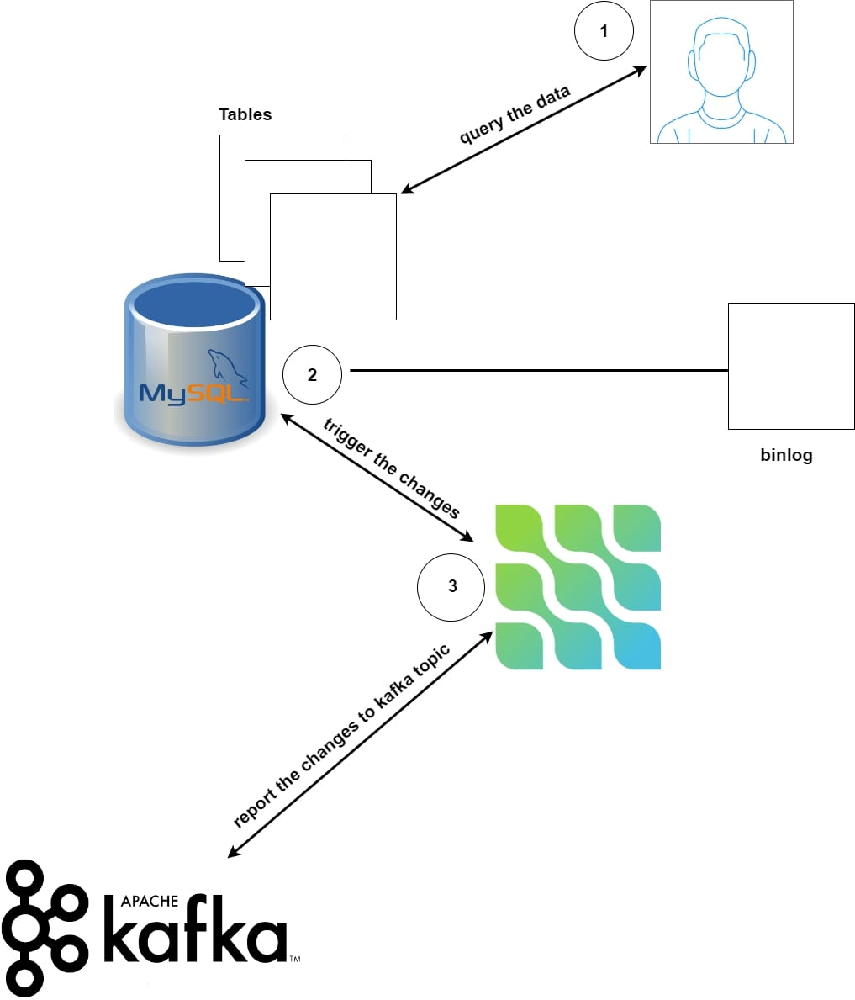
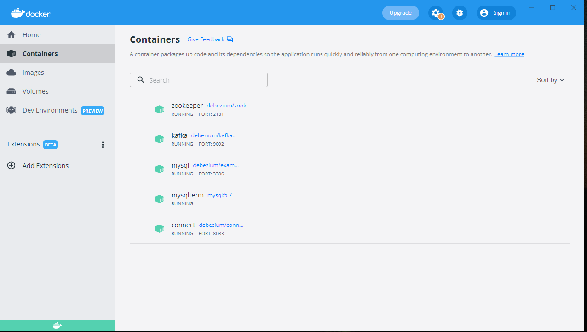

# CDC-with-debezium-
this is a tutorial from which you can learn how kafka connector monitor the changes in the databases . 
We are going to use the debezium kafka connector for a MySql database 


## Architecture of the project : 
 


```sh
```

## Commands used : 
1.  start the zookeeper container . 
```sh
docker run -it --rm --name zookeeper -p 2181:2181 -p 2888:2888 -p 3888:3888 quay.io/debezium/zookeeper:2.0
```
#### arguments  : 

- --rm : the container will be removed after being stoped 
- --name zookeeper : We name the container, it is a best practice when dealing with a lot of container either on a development or production environment .
- -p 2181:2181 -p 2888:2888 -p 3888:3888 : Maps the container ports to the ports of docker host , we exposed three ports to make the other applications talk to zookeeper . 

Communication inside the world of containerization  : 
  


2. start Kafka server container  : 

```sh
docker run -it --rm --name kafka -p 9092:9092 --link zookeeper:zookeeper quay.io/debezium/kafka:2.0
```

#### arguments  : 
- -it, - rm, --name : explained above (step 1) 
- --link : it tells the running container that he needs to talk to zookeeper which is running on the same environment which is docker host

3. start MySQL database from which Debezium can capture changes : 

```sh
docker run -it --rm --name mysql -p 3306:3306 -e MYSQL_ROOT_PASSWORD=debezium -e MYSQL_USER=mysqluser -e MYSQL_PASSWORD=mysqlpw quay.io/debezium/example-mysql:2.0
```

#### arguments  : 
- -it, --rm, --name : explained above (step 1 & 2 ) 
- -e MYSQL_ROOT_PASSWORD=debezium -e MYSQL_USER=mysqluser -e MYSQL_PASSWORD=mysqlpw : we create a user and a password (required by Debezium mysql connector) .


4. start MySQL client to connect to the Database container that we've already launched : 

```sh
docker run -it --rm --name mysqlterm --link mysql --rm mysql:8.0 sh -c 'exec mysql -h"$MYSQL_PORT_3306_TCP_ADDR" -P"$MYSQL_PORT_3306_TCP_PORT" -uroot -p"$MYSQL_ENV_MYSQL_ROOT_PASSWORD"'
```

5. Start Kafka connect and link it to MySQL database and Kafka  : 

```sh
docker run -it --rm --name connect -p 8083:8083 -e GROUP_ID=1 -e CONFIG_STORAGE_TOPIC=my_connect_configs -e OFFSET_STORAGE_TOPIC=my_connect_offsets -e STATUS_STORAGE_TOPIC=my_connect_statuses --link kafka:kafka --link mysql:mysql quay.io/debezium/connect:2.0
```


## Output : 
   


## Conclusion : 
I hope you enjoyed this concept , it's aim is to walk you step by step on how complex concepts are working and break it down in your local environment . Feel free to ask me any question and I'm looking forward to hearing your suggestions about new topics . Thank you and keep learning ! 

Link to the article :  


