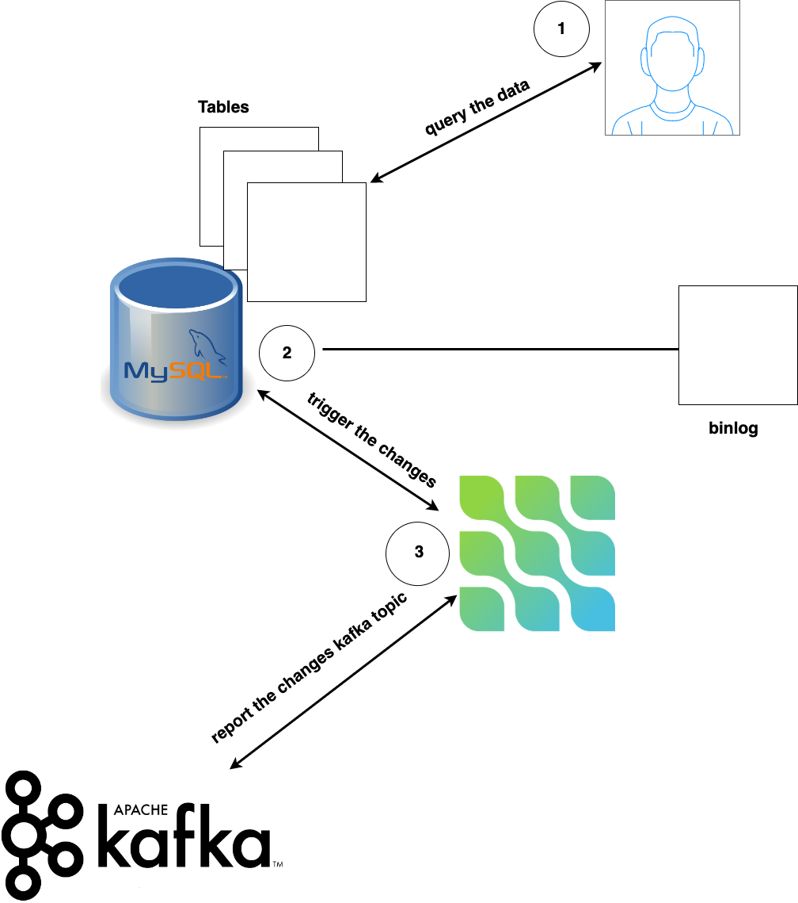

# CDC-with-debezoum-
this is a tutorial from which you can learn how kafka connector monitor the changes in the databases . 
We are going to use the debezium kafka connector for a MySql database 

## Architecture of the project : 
 
‚

## Commands used : 

## Conclusion : 

